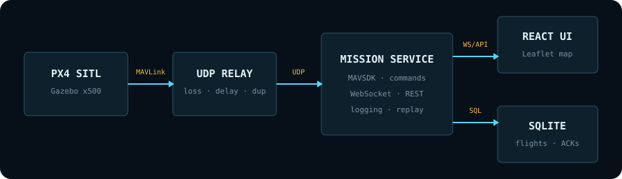

# SkyLink

SkyLink is a local, simulation-only drone ground station for PX4. It streams telemetry to a browser, edits and uploads waypoint missions, sends acknowledged commands, records flights, replays telemetry, and tests behavior across an unreliable MAVLink link.



## Quick start: demo mode

The demo vehicle needs no PX4 installation.

```bash
make setup
make dev
```

Open <http://localhost:3000>. The API and interactive documentation are at <http://127.0.0.1:8000/docs>.

Try this sequence:

1. Confirm the header says `SIMULATION` and the link is healthy.
2. Arm, then take off. Each action creates a UUID, is persisted, and progresses from queued to acknowledged.
3. Open Mission, click the map twice, drag a marker, save, and upload.
4. Open Flights and replay a recorded session. Commands remain locked while replay is active.
5. Open Link and apply a fault profile. In demo mode the profile is stored; with PX4 mode the UDP relay applies it to MAVLink packets.

## PX4 + Gazebo

The supported macOS setup is intentionally separate because it installs a large simulator toolchain and may ask for an administrator password.

```bash
./scripts/setup_px4.sh
make px4
```

The setup supports headless simulation without an administrator password. For a visible Gazebo window, install XQuartz separately with `brew install --cask xquartz` or run `SKYLINK_INSTALL_XQUARTZ=1 ./scripts/setup_px4.sh`. PX4 is kept in the sibling `SkyLink-PX4` directory because its nested macOS build does not handle spaces in checkout paths.

In a second terminal, select PX4 mode and run SkyLink:

```bash
SKYLINK_MODE=px4 make dev
```

PX4 sends to the relay on UDP `14540`. The relay uses `14541` for its application-facing socket and forwards to MAVSDK on `14542`. Only loopback addresses are accepted.

## Quality checks

```bash
make test
make check
make benchmark
```

Benchmark output is written to `data/benchmarks/reliability.json` and `.csv`. Results from the deterministic harness are not real PX4 measurements; use the live SITL path before quoting numbers externally.

## Repository map

- `app`, `components`, `hooks`, `lib`: React ground station and shared browser contracts.
- `mission_service/skylink`: FastAPI service, adapters, persistence, replay, reliability, and UDP relay.
- `mission_service/tests`, `tests`: backend and frontend automated tests.
- `scripts`: setup, environment checks, local development, and PX4 launch helpers.
- `docs/LEARNING.md`: guided code tour and experiments.

## Reliability boundary

The browser retries transient submissions with the same UUID, and the mission service persists and deduplicates that UUID. Reusing an ID with a different payload returns `409`. MAVSDK then uses MAVLink command acknowledgements for the PX4 hop. This prevents duplicate dispatch within a running service, but it is not crash-proof end-to-end exactly-once execution; that would require a custom onboard receiver that understands the same application command ID.

## Safety

SkyLink v1 is for simulation. The service rejects non-loopback vehicle addresses, displays a persistent simulation banner, asks for confirmation before flight commands, and disables commands during replay or when the API is offline.
